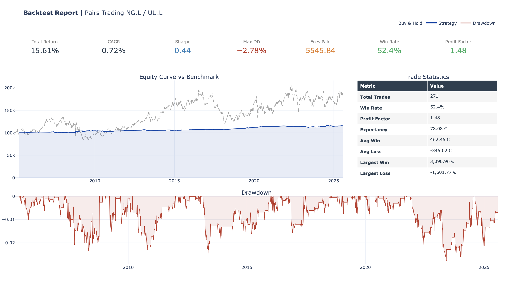

# Backtesting Engine (Python)

A modular, event-driven backtesting framework designed to simulate trading strategies with a focus on architectural robustness. It decouples strategy logic from execution, enabling the simulation of multi-asset portfolios under realistic market conditions.

### Core Features

* **N-Asset Architecture:** Unlike vector-based backtesters, this framework uses an event-driven approach. The abstract `Strategy` class is designed to handle N assets simultaneously. The logic isn't tied to a single ticker. The engine passes the entire historical window to the strategy, allowing for complex portfolio optimization.
* **Fees:** Accounts for transaction costs per trade.
* **Slippage:** Models execution deviations from theoretical prices.
* **Integer Constraints:** Automatically converts fractional target weights into integer share counts to reflect real-world position sizing.

* **OOP Design:** Enforces a strict separation between Signals Generation (Abstract Strategy Class) and Trade Execution.

### Performance Reporting

The engine includes a reporting module that generates a **synthetic one-pager** for immediate strategy assessment.

* **Consolidated View:** Aggregates PnL, Drawdown, and other metrics into a single dashboard.
* **Visual Analysis:** Plots equity curves and rolling statistics to visualize strategy behavior over time.

### Implemented Strategies (as examples)

* **Pairs Trading:** Statistical arbitrage based on cointegration (Rolling OLS).
* **SMA Cross:** Standard trend-following logic using moving average crossovers.

Pairs Trading Strategy Report:

### Limitations & Future Work

As a student project, the current implementation prioritizes architectural clarity over computational speed.

* **Performance**: The row-by-row iteration (event-driven) is computationally expensive compared to vectorized backtesting.

* **Optimization**: Recursive algorithms (e.g., Kalman Filters) should replace repetitive rolling OLS calculations to improve runtime.

* **Data Handling**: Requires a robust layer to handle non-price data and asynchronous data streams.
